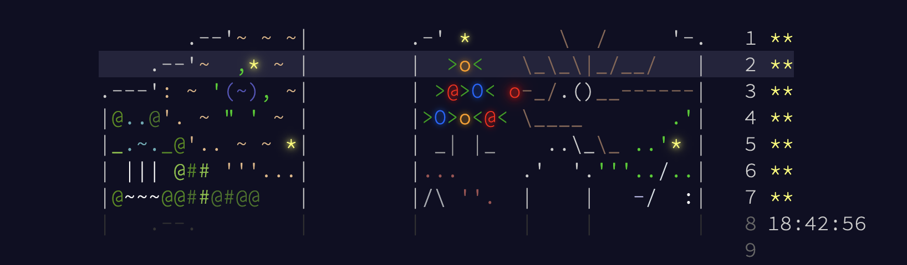

# Advent Of Code

My solutions for Advent of Code. In accordance with the event rules, input data is not included in repository.

[Advent of Code](https://adventofcode.com) is an annual online event held during December, where participants solve daily programming challenges designed to test problem-solving skills and computational thinking. Each day from December 1st to 25th, a new puzzle is released, featuring creative scenarios and increasing difficulty levels. It's a fun and educational way for programmers of all skill levels to practice coding, explore algorithms, and improve proficiency in their preferred programming languages. Advent of Code fosters a strong community, as participants often share strategies, solutions, and insights through forums, social media, and coding platforms.

